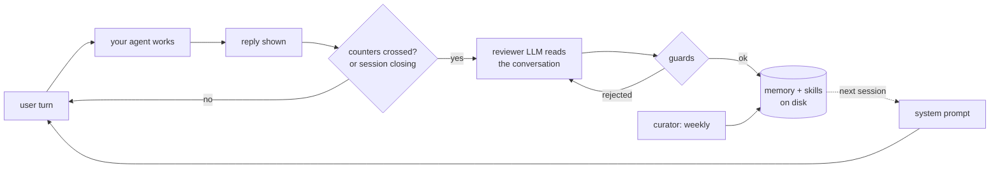

# Muscle Memory

*Agents that get better with practice.*

**Make any LLM agent self-learning in about ten lines.** Your agent remembers who the user is,
turns hard-won procedures into reusable skills, fixes those skills when they turn out wrong, and
forgets what stops being useful — across conversations, without fine-tuning.

- **Provider-neutral.** Claude, OpenAI, Bedrock/Vertex/Foundry, local models via any
  OpenAI-compatible server, or any `callable(system, user) -> str`.
- **Framework-neutral.** A plain tool loop, LangChain/LangGraph, or your own harness. It reads
  OpenAI, Anthropic and LangChain message formats natively.
- **Zero dependencies** in the core. Plain Markdown and JSON on disk, which you can read, edit and
  put in git.
- **Governed.** It refuses secrets and injected instructions. Writes need a fresh read. It has an
  approval gate, a ledger with one-step rollback, and decay that archives instead of deleting.

The design is distilled from the learning loop in
[Hermes Agent](https://github.com/NousResearch/hermes-agent) (MIT, Nous Research), generalized so
that any agent can use it.

<!-- Demo GIF goes here once recorded:  -->

**Try it in one minute, no API key needed:**

```bash
git clone https://github.com/msathiyakeerthi/musclememory && cd musclememory
pip install -e ".[dev]"
python examples/offline_demo.py
```

---

## Install

```bash
pip install -e ".[anthropic]"    # or [openai], [bedrock], [langchain]; the core needs none
```

## Integrate — the four touch points

```python
from musclememory import SelfLearner, anthropic_llm
import anthropic

client = anthropic.Anthropic()
learner = SelfLearner("./.musclememory", llm=anthropic_llm(client))   # llm = the REVIEWER

with learner, learner.session() as session:
    system = BASE_SYSTEM + "\n\n" + session.system_prompt()          # 1. learned context
    tools = MY_TOOLS + session.tools("anthropic")                     # 2. learning tools

    while chatting:
        ...                                                           # your normal agent loop
        if session.handles(tool_name):                                # 3. route its tool calls
            result = session.handle_tool_call(tool_name, tool_input)
        ...
        session.end_turn(messages)   # 4. after the reply is shown (never delays it)
# leaving the `with`: the session's final review runs, and close() waits for it
```

That is the whole integration. Working, runnable versions:

| File | Shows |
|---|---|
| [`examples/claude_agent.py`](examples/claude_agent.py) | Full Claude tool-use agent; `--bedrock REGION` for Amazon Bedrock |
| [`examples/openai_agent.py`](examples/openai_agent.py) | Same on Chat Completions; `--base-url` for Ollama / vLLM / LM Studio |
| [`examples/offline_demo.py`](examples/offline_demo.py) | The whole loop with **no API key**. Good for teaching |
| [`examples/multi_session_demo.py`](examples/multi_session_demo.py) | 12 conversations over 6 sessions, then checks that session 7 is measurably better; `--real` to drive it with Claude |

**LangChain / LangGraph:**

```python
from musclememory.integrations.langchain import langchain_tools
agent = create_agent(model, tools=my_tools + langchain_tools(session), system_prompt=...)
session.end_turn(state["messages"])          # LangChain messages are read natively
```

**No tool use?** It still learns: the background reviewer does all the writing. Skip steps 2 and 3,
render the context with `session.system_prompt(with_tools=False)`, and pull relevant skills into the
user turn with `learner.recall(user_message)`.

---

## How it works



**Two stores, two loading rules.**

| | Memory | Skills |
|---|---|---|
| Holds | Facts: who the user is, environment, conventions | Procedures for a *class* of task |
| Size | 1–2 sentences per entry, char-budgeted | 100–200 lines + optional `references/`, `templates/`, `scripts/` |
| Loaded | Every session, in full | Index only (name + ≤60-char description); body on demand |

**When to look.** It counts two things, in different units:
- **User turns** trigger a memory review, because a long chat reveals facts.
- **Tool-calling rounds** trigger a skill review, because hard work is what discovers a procedure.

Both default to 10. If the agent saves something itself during a turn, that counter resets, so you
don't pay to review what was just saved. `review_on_session_end` covers sessions shorter than the
intervals.

**Who reviews.** A separate LLM call runs after the reply, on a background thread. It only has to
return JSON, so any chat model works. Its instructions carry the lessons that make learning safe:
- Class-level skills, never incident diaries.
- A pitfall is a rule plus its mechanism.
- Patch before you create.
- Write only what the conversation actually showed.
- A **do-not-capture list**: an agent that writes down "tool X is broken" will refuse to use X long
  after it is fixed. It captures the fix instead.

**Frozen context.** `session.system_prompt()` is rendered once and never changes during the
conversation. New learning lands on disk and appears in the *next* session. This keeps the
provider's prompt cache valid.

## Guards

Every write, whether from the agent, the reviewer or you, goes through the same rules:

| Guard | Why |
|---|---|
| Descriptions over 60 chars are **refused**, not truncated | Only 60 chars route. A longer description silently makes the skill unreachable |
| Patches require the hash of the version you read | No overwriting edits made underneath you. The agent must `skill_view` first |
| The reviewer may only edit skills it created, never pinned ones | Your skills stay yours (`musclememory adopt NAME` hands one over) |
| Secrets and prompt-injection phrases are refused; invisible/bidi Unicode is stripped | Learned text enters every future prompt. These checks are heuristics, not a security boundary |
| `write_approval=True` stages agent writes for review | Human in the loop for sensitive domains |
| Every change is logged with its prior content | `musclememory rollback ID` undoes one edit, and refuses if the file changed since |
| Decay archives, never deletes | `active → stale (14d) → archived (30d)`; `musclememory restore NAME` |

## Configuration

```python
from musclememory import LearnerConfig
SelfLearner(root, llm, config=LearnerConfig(
    memory_review_every_turns=10,        # 0 disables
    skill_review_every_tool_rounds=10,   # 0 disables
    review_on_session_end=True,
    write_approval=False,
    extra_review_instructions="Never store customer names, emails or order IDs.",
))
```

All fields and defaults are in [`config.py`](src/musclememory/config.py). `on_event=callback` receives
a dict after every review, which you can use to show "learned: …" in your UI.

## CLI

```bash
musclememory --dir .musclememory status          # counts and budgets
musclememory memory | skills [--all] | show NAME [FILE]
musclememory pending | approve ID|all | reject ID|all
musclememory pin NAME | unpin NAME | adopt NAME | restore NAME
musclememory ledger [-n N] | rollback ID | curate
```

## Operating notes

- **Always `close()`** (or use `with`). Reviews run on a background thread, and `close()` waits for
  them. An `atexit` hook does the same on a normal exit, but **anything that calls `os._exit` kills
  threads without waiting**. Close first. A review that isn't awaited is learning that never lands.
- **Close your sessions.** `close()` also closes open sessions it still holds, but sessions are
  tracked weakly: one your code dropped without closing loses its final review.
- **Multi-user apps:** give each user or tenant their own root, e.g. `SelfLearner(f"data/{user_id}", …)`.
  One process should own a root at a time.
- **Cost:** a review is one LLM call over the conversation, usually two with a repair round.
  Reviews happen at most every N turns plus once per session. Choose the reviewer model
  independently of the agent's.
- **Resuming a conversation:** `learner.session(history=messages)` restores the counters.
- **Amazon Bedrock:** the example defaults to the Messages-API (Mantle) client. If your account
  returns *"model does not exist"* there, pass `--bedrock-runtime`, which uses `AnthropicBedrock`
  with an inference-profile ID such as `us.anthropic.claude-opus-5`.

## Tests

```bash
pip install -e ".[dev,anthropic,openai,langchain]"
pytest            # 72 tests, offline — a scripted stand-in plays the reviewer
```

Live-verified on Claude Opus 5 via Amazon Bedrock:
- A preference stated in one process was known and followed in the next.
- A real reviewer produced a class-level skill that embedded the user's correction.
- The same reviewer recorded an environment failure as its fix, not as "tool broken".

## Not included (yet)

- Search over past conversations (Hermes' `session_search`).
- An MCP server, so hosts that only speak MCP could use the tools.
- A TypeScript port.
- A Claude Code `Stop` hook adapter.

## License

MIT. Learning-loop design adapted from Hermes Agent (MIT © Nous Research).
