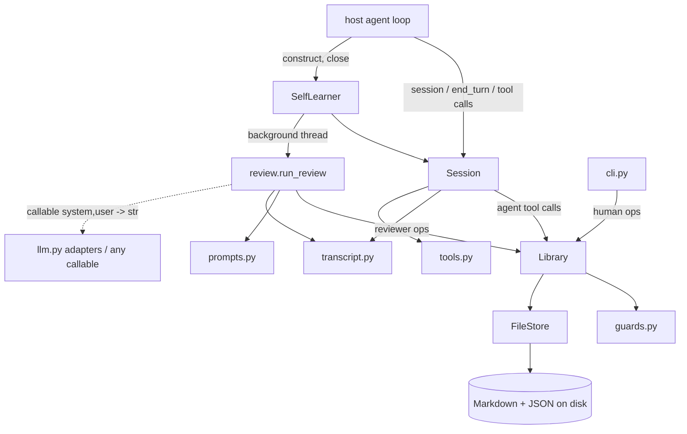
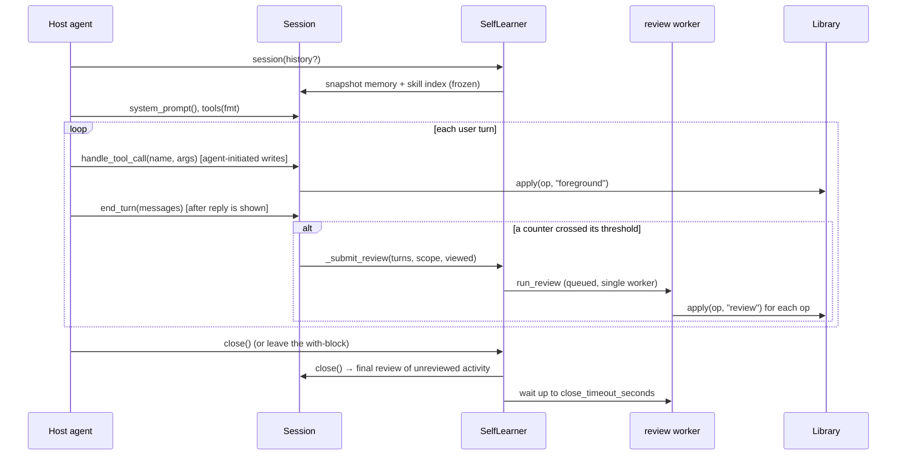

# Architecture

This document is for people changing `musclememory` itself. For how to *use* it, see the
[README](../README.md).

`musclememory` adds a learning loop to an existing LLM agent. The agent keeps two stores on disk:
**memory** (short facts, always loaded) and **skills** (procedures, loaded on demand). A
**reviewer** LLM reads each conversation after the fact and proposes writes to those stores. Every
write, whoever proposes it, passes the same policy layer. The core uses only the standard library.

## Modules at a glance



| Module | Responsibility |
|---|---|
| `learner.py` | `SelfLearner`: one profile (root dir + reviewer). Owns the review thread, session tracking, shutdown, curation. |
| `session.py` | `Session`: one conversation. Frozen context, learning tools, review triggers. |
| `review.py` | One review: render transcript → call LLM → parse JSON → apply ops → repair round. |
| `prompts.py` | All prompt text: reviewer instructions, reviewer user message, repair message, the agent's learned-context block. |
| `library.py` | `Library`: the policy layer. The only code that mutates the store. Governance (approve, rollback, pin, curate). |
| `guards.py` | Content hygiene: sanitize, secret/injection scan, name and description checks. |
| `store.py` | `FileStore`: file layout, parsing, atomic writes, ledger and pending files. No policy. |
| `transcript.py` | `normalize()`: any provider's message list → neutral `Turn`s; counting and rendering. |
| `tools.py` | The four agent tools as neutral JSON Schema, plus OpenAI/Anthropic formatters. |
| `llm.py` | Reviewer adapters for the `anthropic` and `openai` SDKs. |
| `integrations/langchain.py` | The tools as LangChain `StructuredTool`s. |
| `cli.py` | `musclememory` command: inspection and governance over a root, as actor `"user"`. |

Dependencies point downward: `store` knows nothing about policy, `library` knows nothing about
sessions or LLMs, and `review` knows nothing about threads. Provider SDKs are imported only in
examples and inside `integrations/langchain.py`. `llm.py` never imports them: it takes an
already-built client.

## The lifecycle of a conversation



### Frozen context

`Session.__init__` reads memory and the skill index once. `system_prompt()` returns the same
string for the whole session, even if writes land meanwhile. This keeps the host's system prompt
byte-identical, so the provider's prompt cache stays valid. New learning shows up in the *next*
session. The `skills_list` and `skill_view` tools read live, so the agent can still find a skill
it created earlier in the same conversation.

### Review triggers

`end_turn(messages)` takes the **full, cumulative** message list, normalizes it, and looks only at
turns it hasn't consumed yet. If the list got shorter, it assumes the host passed a fresh list and
resets. Two counters, in different units:

- `_turns_since_memory` goes up by 1 per `end_turn`. It fires a **memory** review at
  `memory_review_every_turns`.
- `_rounds_since_skill` goes up by the number of assistant messages with tool calls. It fires a
  **skill** review at `skill_review_every_tool_rounds`.

If the agent saved a memory (or skill) through its tools during the turn, that counter does not
advance, so the reviewer isn't paid to rediscover what was just saved. A threshold of `0` disables
its trigger. When both fire, the review scope is `"both"`. `Session(history=...)` restores the
memory counter from the history's user-turn count, so a resumed conversation doesn't start at zero.

`close()` runs one last review when `review_on_session_end` is set and either counter is non-zero.
`review_now()` forces one, with an optional `focus` hint for the reviewer.

### Threading and shutdown

`SelfLearner` creates a `ThreadPoolExecutor(max_workers=1)` lazily. A single worker means reviews
apply **in submission order** and never race each other. Writes from the foreground (agent tools)
can still interleave with a review. `FileStore.lock` (an `RLock`) serializes them, and base-hash
checks catch stale reads.

When the executor is unavailable, the review runs inline and a completed `Future` is returned.
That happens with `background=False`, after `close()`, or during interpreter shutdown.

`close()` closes every session still referenced in a `WeakSet`, which submits their final reviews.
It then waits up to `close_timeout_seconds` and shuts the executor down. An `atexit` hook calls
`close()` when the host forgot. `os._exit` bypasses all of this, so the README tells hosts to
close first.

## The reviewer

`run_review(llm, library, turns, scope, viewed, focus)`:

1. **Render** the transcript (`transcript.render`). It drops system messages, because they already
   contain the learned context. Tool results are clipped to 800 chars and tool arguments to 400.
   Past `review_transcript_max_chars`, the oldest text is dropped and the tail is kept.
2. **Pick skills in play** (`select_skills`): first the skills the agent `skill_view`ed in the
   session, since they are the likeliest to need fixing. The remaining slots, up to
   `review_max_skill_bodies`, go to the best lexical matches from `_util.overlap_score`. These
   are shown in full with their `base_hash` and an `editable`/`read-only` flag.
3. **Prompt**: `build_system(scope)` assembles only the sections relevant to the scope. Developer
   rules from `extra_review_instructions` come last and override the rest. `build_user` shows the
   current memory (with budget usage), the skill index, the skills in play, the transcript and the
   focus.
4. **Parse**: `extract_json` accepts bare JSON, a fenced block, or the first balanced `{...}` in
   prose. If parsing fails, the call is retried once with a stricter nudge. A second failure ends
   the review with `error` set.
5. **Apply** each op through `Library.apply(op, "review")`.
6. **Repair**: if any op was rejected, `build_repair` shows the reviewer its previous reply and the
   rejection reasons, and asks for corrected versions of the rejected ops only. This repeats up to
   `review_repair_rounds` times. The skills in play are re-selected each round, so the hashes are
   fresh.

The reviewer contract is plain JSON (`{memory_ops, skill_ops, notes}`), so any chat model works:
no tool use or structured output is needed. The LLM is just `Callable[[str, str], str]`. The
prompt text in `prompts.py` carries the learning policy: class-level skills, pitfalls stated as a
rule plus its mechanism, patch before create, and the do-not-capture list. Changes there change
what gets learned, and the offline tests can't catch a regression in quality.

The outcome is a `ReviewResult`. `SelfLearner._emit` passes it to `on_event` as a dict, or logs it
to the `musclememory` logger.

## The policy layer: `Library.apply`

Every mutation goes through `apply(op, actor)`. An op is a dict:
`{"kind": "memory"|"skill", "op": ..., ...}`. Handlers are looked up by `(kind, op)`:

| kind | op | Key rules |
|---|---|---|
| memory | `add` | Sanitize and scan. The `§` delimiter line is forbidden in content. A whitespace-and-case-insensitive duplicate is a successful no-op. Must fit the char budget. |
| memory | `replace` | `old_text` must match exactly one entry as a substring. The new text may not duplicate another entry. Must fit the budget. |
| memory | `remove` | `old_text` must match exactly one entry. |
| skill | `create` | Valid name (lowercase-hyphenated, ≤64). Description is one line, ≤`description_max_chars` (**refused, not truncated**). Body size limit. Scanned. Fails if the name exists or is archived. |
| skill | `patch` | Ownership check. **`base_hash` must equal the current hash.** `old_text` must occur exactly once. The result must keep the frontmatter `name` and a valid description. The body can't become empty or oversized. |
| skill | `write_file` | Path must be `references/`, `templates/` or `scripts/<...>`, with no `..` and not absolute. Ownership check. Replacing an existing file needs its `base_hash`. |

**Actors** and what they may do:

- `"foreground"`: the agent through its tools. Skills it creates get `origin="agent"`.
- `"review"`: the background reviewer. Skills it creates get `origin="learned"`. It may only patch
  or add files to skills whose origin is `learned` and that are not pinned. Otherwise the op is
  refused with a pointer to `musclememory adopt`.
- `"user"`: a human via the CLI or the API. Skills get `origin="user"`. It may skip `base_hash` and
  is never gated by approval.

A skill with no entry in `usage.json` (dropped in by hand) is treated as `origin="user"`.

**Read-before-write.** A `Session` records the hash from each `skill_view` in `_viewed`. The patch
tool refuses unless the skill was viewed and passes that hash as `base_hash`. After a successful
write, `_viewed` is updated with the new hash, so the agent can make consecutive edits without
re-reading. The reviewer gets the hashes from its prompt.

**Approval gate.** With `write_approval=True`, non-user writes run the handler with `dry_run=True`
(validation only). Valid, state-changing ops are then saved to `state/pending/<id>.json`, and
`staged=True` is returned. `approve(id)` replays the op with `bypass_approval=True` under the
original actor, so it is re-validated against the current state.

**Ledger and rollback.** `_commit` writes the file and appends a ledger line holding the full
prior content (`before`) and the new hash (`after_hash`). `rollback(id)` **fails closed** if the
file's current hash differs from `after_hash`, meaning something changed it since. Undoing a skill
creation archives the skill instead of deleting it. Rollbacks are ledgered too.

**Decay.** `curate()` looks only at `learned`, unpinned skills. Idle time is measured from the
latest of `last_used_at`, `last_patched_at` and `created_at`. A skill goes `active → stale` after
`stale_after_days` and moves to `skills/.archive/` after `archive_after_days`. `skill_view` bumps
`use_count` and brings a stale skill back to active. `SelfLearner.__init__` runs `curate()` when
`curate_every_days` have passed, tracked in `state/curator.json`.

### Guards (`guards.py`)

- `sanitize` normalizes newlines and removes Unicode format characters (category `Cf`: zero-width
  characters, bidi overrides, tag characters), except the ZWJ, which emoji need. It strips edges by
  default. Patch fragments use `strip=False`, because their edge newlines matter.
- `scan` refuses text containing common secret shapes (API keys, AWS, private keys, GitHub, Slack
  and Google tokens) and prompt-injection phrases. These are **heuristics, not a security
  boundary**. For stricter rules, use `extra_review_instructions` and the approval gate.

## Storage (`store.py`)

```
<root>/
  memory/USER.md              entries separated by a line holding only "§"
  memory/MEMORY.md
  skills/<name>/SKILL.md      ---\nname: ...\ndescription: "<json string>"\n---\n\n<body>
  skills/<name>/references|templates|scripts/...
  skills/.archive/<name>/     archived (a timestamp suffix is added on a name clash)
  state/usage.json            per skill: origin, state, pinned, use_count, timestamps
  state/ledger.jsonl          append-only change log with prior content
  state/pending/<id>.json     staged writes
  state/curator.json          last decay run
```

- Everything is plain text a person can read, edit and commit.
- Frontmatter parsing is deliberately minimal: only flat `key: value` lines. The description is
  written with `json.dumps`, which is also a valid YAML double-quoted scalar.
- `atomic_write` writes a temp file in the same directory and then calls `os.replace`, retrying on
  `PermissionError`, because Windows scanners hold files briefly. It always writes **LF**, because
  the `§` delimiter is matched as `"\n§\n"`. `read_text` uses universal newlines, so a
  hand-edited CRLF file still parses.
- Concurrency model: **one process per root.** Inside a process, `FileStore.lock` serializes
  writers. Across processes, only the hash checks help. Multi-tenant hosts use one root per
  tenant.

## Transcript normalization

`transcript.normalize` accepts OpenAI chat messages, Anthropic content blocks (dicts or SDK
objects), LangChain messages (`.type` = human/ai/tool) and plain `{role, content}` dicts. They can
be mixed in one list. It reads fields through `_get`, which works on both dicts and attribute
objects. It maps role aliases, gathers tool calls from `tool_use` blocks, `tool_calls[].function`
or LangChain `tool_calls[].args`, and skips thinking, image and document blocks. Everything
downstream (counting, rendering) sees only `Turn(role, text, tool_calls)`. Support for a new
message format belongs here.

## Integration surface

The host touches four points: `session.system_prompt()`, `session.tools(fmt)`,
`session.handles` / `handle_tool_call`, and `session.end_turn(messages)`. Tool specs are defined
once in neutral JSON Schema, and `FORMATTERS` adapts them to each provider. LangChain wraps the
same specs.

Agents without tool use skip the tools. They render the context with `with_tools=False` and call
`learner.recall(query)`, which ranks skills lexically and returns full skill text to put in the
*user* turn, keeping the system prompt stable. The reviewer still does all the writing.

## Invariants to preserve

1. **Learning never breaks the host.** Tool handlers return a JSON error instead of raising.
   Review failures, `on_event` callback failures and malformed ops are all caught and logged.
2. **One write path.** No code outside `Library` mutates the store's content. New operations
   become a new `(kind, op)` handler with a `dry_run` branch, so approval keeps working.
3. **Every commit is ledgered with its prior content**, so it can be rolled back.
4. **Nothing is deleted by automation.** Decay and rollback of a creation both archive.
5. **The session prompt is frozen.** Don't make `system_prompt()` reflect mid-session writes.
6. **The core stays stdlib-only.** SDKs belong in extras, adapters and examples.
7. **Files on disk are always LF** (use `atomic_write`).

## Testing

Tests are offline. `tests/conftest.py` provides `ScriptedLLM`, which returns queued replies (a
string, or a callable of `(system, user)`) and records every prompt. It also provides `ops(...)`,
which builds reviewer JSON, and fixtures for a bare `Library` and for `SelfLearner`s that close
themselves on teardown. Behaviour that depends on the reviewer's *judgement* can't be tested here.
The README lists what was verified live against a real model.
